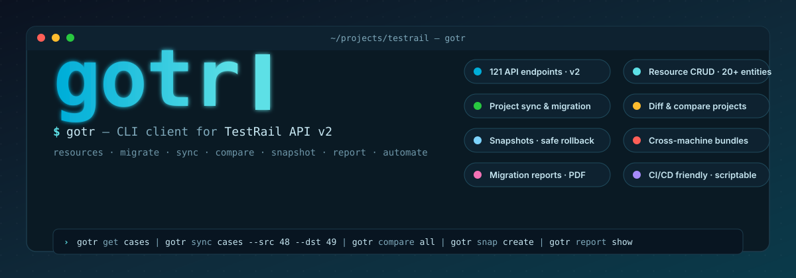

# gotr — CLI Client for TestRail API

<p align="center">
  
</p>

<p align="center">
  <a href="README.md">English</a> · <a href="README_ru.md">Русский</a>
</p>

<p align="center">
  <a href="https://github.com/Korrnals/gotr/releases/latest"></a>
  <a href="go.mod"></a>
  <a href="LICENSE"></a>
  <a href="docs/index.md"></a>
</p>

> 🛠️ Professional CLI for TestRail API v2 — built for QA engineers and automation specialists who need fast bulk operations, safe migrations with rollback, and CI/CD-friendly automation.

`gotr` is a fully-featured terminal client that covers the entire TestRail API v2 surface (121 endpoints), adds operator-grade safety (snapshots, dry-run, rollback), and ships with shell completion, an interactive mode, and a portable bundle format for cross-instance transfers. Every long-running operation streams progress, every destructive action is reversible, and every workflow has a documented runbook.

---

## 📚 Navigation

- 📖 [Documentation index](docs/index.md) — full EN/RU catalog
- 🚀 [Installation](docs/en/guides/installation.md) · ⚙️ [Configuration](docs/en/guides/configuration.md) · 💬 [Interactive mode](docs/en/guides/interactive-mode.md)
- 📋 [Commands catalog](docs/en/guides/commands/index.md) — reference for every subcommand
- 📘 [Instructions & runbooks](docs/en/guides/instructions/index.md) — operations playbooks
- 🏛️ [Architecture](docs/en/architecture/index.md) · 📊 [Reports](docs/en/reports/index.md) · 🛠️ [Operations](docs/en/operations/index.md)
- 📰 [CHANGELOG](CHANGELOG.md) — release history and unreleased scope

---

## 🚀 Installation & Quick Start

```bash
# 1. Install (Linux / macOS)
curl -sL https://github.com/Korrnals/gotr/releases/latest/download/gotr-$(uname -s | tr '[:upper:]' '[:lower:]')-amd64 -o gotr
chmod +x gotr && sudo mv gotr /usr/local/bin/

# 2. Initialize configuration (URL · username · API key)
gotr config init

# 3. Verify installation against your TestRail instance
gotr self-test

# 4. Run your first command
gotr get projects
```

**Detailed instructions** (Windows, package managers, build from source, troubleshooting): [Installation guide](docs/en/guides/installation.md).

---

## ✨ Key Features

Each row links to the dedicated reference page; the link label matches the actual subcommand.

| Capability | Subcommand | What it does |
|---|---|---|
| 🔍 **Resource retrieval** | [`get`](docs/en/guides/commands/get.md) | Read cases, suites, sections, runs, plans, milestones, users, and 100+ other resources with filters and pagination. |
| 🔄 **Cross-project synchronization** | [`sync`](docs/en/guides/commands/sync.md) | Migrate cases, shared steps, suites, and sections between projects with intelligent dedup, mapping, and `--verify-coverage`. |
| 🆚 **Project comparison** | [`compare`](docs/en/guides/commands/compare.md) | Diff cases, suites, plans, milestones, datasets, and more between two projects; export to JSON / YAML / table. |
| 📸 **Snapshots & rollback** | [`snap`](docs/en/guides/commands/snap.md) | Snapshot any mutation, list, restore, garbage-collect by per-category TTL. Every destructive op produces a snapshot by default. |
| 📎 **Attachments** *(incl. bulk cleanup)* | [`attachments`](docs/en/guides/commands/attachments.md) | Upload, download, list — and **bulk-clean** old attachments with default snapshot + rollback safety net (`cleanup-attachments` category, 7-day retention). |
| 🧹 **Retention & cleanup** | [`cleanup`](docs/en/guides/commands/cleanup.md) | Configurable retention for reports / snaps / exports with `--dry-run` preview and auto-cleanup hooks. |
| 📊 **Test runs & results** | [`run`](docs/en/guides/commands/run.md) · [`result`](docs/en/guides/commands/result.md) | Create runs, add results in bulk, track execution. |
| ✅ **Test-level operations** | [`test`](docs/en/guides/commands/test.md) · [`tests`](docs/en/guides/commands/tests.md) | Inspect individual run-tests and batch sets. |
| 📦 **Portable export / import** | [`export`](docs/en/guides/commands/export.md) | Self-contained bundles (snap / report / migration-archive) with `manifest.json` + `SHA256SUMS`, deterministic, redaction-aware. Symmetric `import`. |
| 📝 **Reports lifecycle** | [`report`](docs/en/guides/commands/report.md) | Categorized reports (`migrations` / `coverage` / `rollbacks` / `testrail/p<N>`), `report show --print`, recursive listing, INDEX reindex. |
| 🧩 **CRUD shortcuts** | [`add`](docs/en/guides/commands/add.md) · [`update`](docs/en/guides/commands/update.md) · [`delete`](docs/en/guides/commands/delete.md) · [`list`](docs/en/guides/commands/list.md) | Universal create / update / delete / list operations across resource types. |
| 💬 **Interactive mode** | [interactive-mode](docs/en/guides/interactive-mode.md) | TTY-guarded survey prompts for `get` / `sync` / `compare` / `report` / `attachments cleanup` / `export` / `import` — no IDs to memorize. |
| 🔧 **Configuration & profiles** | [`config`](docs/en/guides/commands/config.md) | YAML-backed config with environment-variable overrides, multiple profiles, TLS CA-bundle support. |
| 🐚 **Shell completion** | [`completion`](docs/en/guides/commands/completion.md) | bash / zsh / fish / powershell with dynamic `ValidArgsFunction` for files, snap IDs, report paths. |
| 🩺 **Self-test & diagnostics** | [`self-test`](docs/en/guides/commands/self-test.md) | API connectivity, configuration sanity, embedded-tool checks. |
| 🪵 **Built-in JSON processing** | `--jq` / `--jq-filter` | Filter and transform any output via embedded `jq` — no external dependencies. |
| 📈 **Streaming progress** | [`progress`](docs/en/guides/progress.md) | Channel-based progress bars with adaptive rate-limit (180 req/min) for parallel fetches. |
| 🐛 **Debug tracing** | `--debug` / `-d` | API request details, per-phase timings, suite/case processing diagnostics. |

For the full reference and the `bdds` / `configurations` / `datasets` / `groups` / `labels` / `milestones` / `plans` / `roles` / `templates` / `users` / `variables` resource commands, see the [commands catalog](docs/en/guides/commands/index.md).

---

## 💡 Examples (excerpt)

The snippets below cover the most common flows. The full set of recipes (with TLS, CI integration, mapping files, redaction, etc.) lives in the [commands catalog](docs/en/guides/commands/index.md) and the [instructions runbooks](docs/en/guides/instructions/index.md).

```bash
# 🔍 Read data
gotr get projects
gotr get cases 30 --suite-id 20069
gotr get sharedsteps 30 --jq --jq-filter '.[] | {id, title}'

# 🔄 Synchronize between projects (with snapshot + verification)
gotr sync full \
  --src-project 30 --src-suite 20069 \
  --dst-project 31 --dst-suite 19859 \
  --approve --save-mapping

# 🆚 Compare projects
gotr compare all --pid1 30 --pid2 34 --save
gotr compare cases --pid1 30 --pid2 34 --save-to results.json --format json

# 📎 Bulk-clean old attachments (snapshot + rollback by default)
gotr attachments cleanup --all-projects --older-than 6M --dry-run
gotr attachments cleanup --project 30 --older-than 6M

# 📸 Roll back any mutation
gotr snap list
gotr snap rollback <snap-id>

# ✅ Create a run and post results
gotr run add 30 --name "Regression Suite" --case-ids "1,2,3,4,5"
gotr result add 12345 --status-id 1 --comment "Passed"

# 📦 Portable bundle export → transfer → import
gotr export snap <snap-id>
gotr import snap ~/.gotr/exports/snaps/snap_<id>_<ts>.tar.gz
```

➡️ **More examples**: [commands catalog](docs/en/guides/commands/index.md) · [interactive mode](docs/en/guides/interactive-mode.md) · [smoke testing](docs/en/guides/smoke-testing.md).

---

## ⚙️ Configuration

Priority (highest → lowest):

1. **CLI flags** — `--url` · `--username` · `--api-key`
2. **Environment variables** — `TESTRAIL_BASE_URL` · `TESTRAIL_USERNAME` · `TESTRAIL_API_KEY`
3. **Config file** — `~/.gotr/config/default.yaml` (multiple profiles supported)

```bash
gotr config init   # create default profile
gotr config view   # inspect current resolution
```

Full reference: [Configuration guide](docs/en/guides/configuration.md) (TLS CA-bundle, retention, warning suppression, cloud / server tuning).

---

## 🗂️ Project Structure

```text
gotr/
├── cmd/                  # CLI commands (Cobra) — one subdir per resource group
│   ├── attachments/      #   upload · list · cleanup (bulk + rollback)
│   ├── bundlecmd/        #   export / import (snap · report · migration-archive)
│   ├── cleanup/          #   retention executor (reports · snaps · exports · all)
│   ├── compare/          #   cross-project diffing
│   ├── get/              #   read-only resource retrieval
│   ├── snap/             #   snapshot list · rollback · gc
│   ├── sync/             #   project synchronization engine
│   ├── report/           #   reports lifecycle (organize · show · view · list)
│   ├── run/ result/ test/ tests/                  #   execution domain
│   └── …                 #   bdds · cases · configurations · datasets · groups
│                         #   labels · milestones · plans · roles · templates
│                         #   users · variables · work
├── internal/
│   ├── client/           #   TestRail API client + paginator + ClientInterface
│   ├── service/          #   business logic (run · result · migration · …)
│   ├── snap/             #   snapshot engine (entities · backup · rollback)
│   ├── snapbundle/       #   tar.gz bundles · manifest · SHA256SUMS
│   ├── reportbundle/     #   zip bundles for report exports
│   ├── bundle/           #   shared bundle mechanics (zip-slip safe)
│   ├── cleanup/          #   attachments cleanup core (walker · filter · executor)
│   ├── retention/        #   retention policies (reports · snaps · exports)
│   ├── report/           #   classify · organize · resolve · INDEX
│   ├── exportsorg/       #   exports/ layout migrator
│   ├── concurrent/       #   primitives — WorkerPool · AdaptiveRateLimiter · retry
│   ├── concurrency/      #   domain orchestration — ParallelController · streaming
│   ├── interactive/      #   survey prompts · TTY guard · MockPrompter
│   ├── output/           #   JSON · YAML · table renderers
│   ├── ui/               #   progress bars · status messages · quiet-mode
│   ├── warnings/         #   suppressible warnings registry + first-time tips
│   ├── state/            #   ~/.gotr/state.json (one-shot flags)
│   ├── flags/            #   shared flag parsing
│   ├── log/              #   structured logging (zap)
│   ├── paths/            #   ~/.gotr layout helpers
│   └── models/           #   API DTOs + config model
├── pkg/
│   ├── testrailapi/      #   API endpoint definitions (135 endpoints)
│   ├── reporter/         #   unified statistics reporter
│   └── snap_smoke/       #   snapshot smoke harness
├── embedded/             #   embedded jq binary (no external deps)
├── docs/                 #   EN + RU documentation
└── main.go               #   entry point
```

Architecture deep-dive: [docs/en/architecture/index.md](docs/en/architecture/index.md).

---

## 🧪 Quality Gates

- ✅ `golangci-lint v2.11.4` — zero issues, `gocyclo ≤ 15` threshold
- ✅ `go test ./... -count=1 -timeout 300s` — green
- ✅ Reproducible deterministic bundles (fixed `ModTime`, stable sort, `tar.FormatPAX`)
- ✅ Race detector + `govulncheck` in CI

Pre-PR checklist: `make verify` (test + vet + lint + build + race + vuln).

---

## 🤝 Contributing

Issues and pull requests are welcome. Please follow the [release protocol](docs/en/operations/index.md) and run `make verify` before opening a PR.

---

## 🙏 Acknowledgements

Built on top of these excellent open-source projects:

| Library | Purpose |
|---|---|
| [spf13/cobra](https://github.com/spf13/cobra) | CLI framework |
| [spf13/viper](https://github.com/spf13/viper) | Configuration management |
| [go.uber.org/zap](https://github.com/uber-go/zap) | Structured logging |
| [stretchr/testify](https://github.com/stretchr/testify) | Testing toolkit |
| [AlecAivazis/survey/v2](https://github.com/AlecAivazis/survey) | Interactive prompts |
| [jedib0t/go-pretty/v6](https://github.com/jedib0t/go-pretty) | Table output |
| [fatih/color](https://github.com/fatih/color) | Colored terminal output |
| [golang.org/x/sync](https://pkg.go.dev/golang.org/x/sync) · [time](https://pkg.go.dev/golang.org/x/time) | Concurrency & rate limiting |
| [jq](https://github.com/jqlang/jq) | Embedded JSON processor (`--jq` / `--jq-filter`) |

---

## 📄 License

[MIT](LICENSE) © Korrnals
